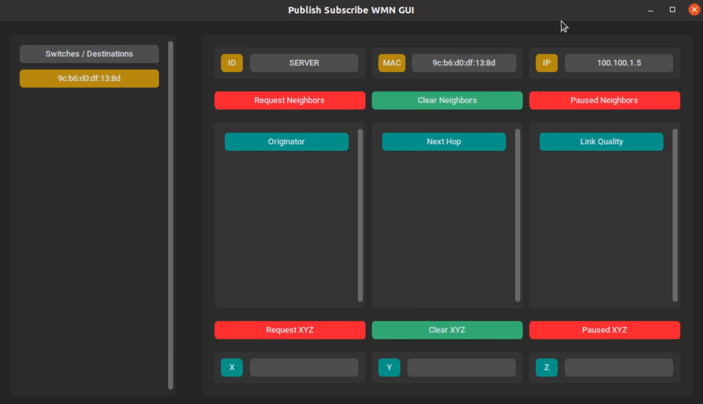
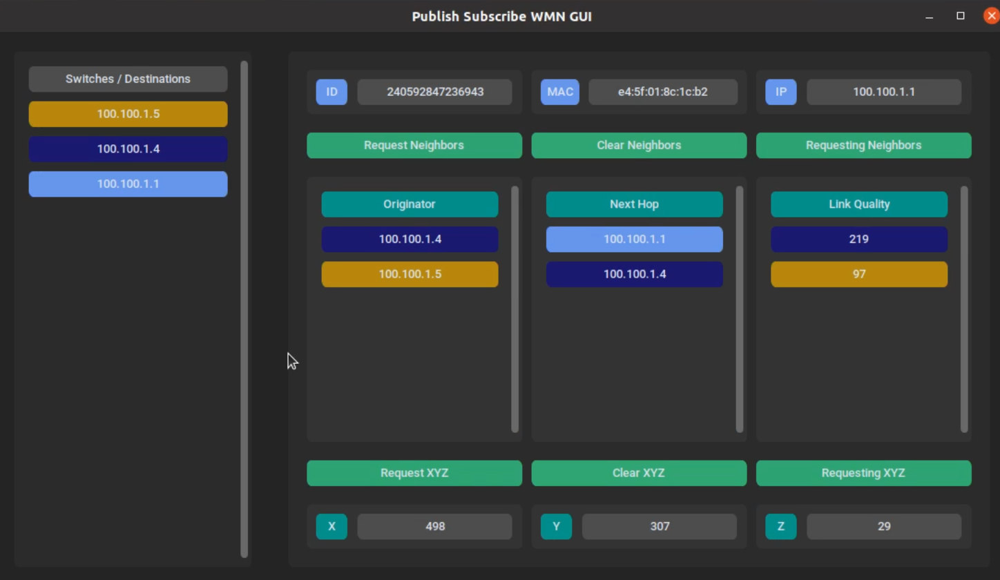

# Pub/Sub GUI Instructions
This graphical user interface, `PubSubGUI.py`, is used for requesting or subscribing data from each OpenvSwitch host. To provide data, there is client code called `PubSubClient13.py` that must run on each OpenvSwitch host. It will be implemented as a client-server approach where the GUI will act as the centralized server and should be ran on the same device as the RYU controller device. 
##### IMPORTANT: YOU WILL NEED SUDO ACCESS TO RUN BOTH THE CLIENT AND GUI!!!

The reason why is because BATMAN and OVS commands need them.
## [PubSubClient13.py](PubSubClient13.py)
The client code is ran on each OpenvSwitch device. For our test bed, each Raspberry Pi will be running this code. It will require python's `requests` to be installed. It should already be available in the requirements in the [OpenFlow folder](../OpenFlow/OpenFlow_Instructions.md) but here is the download command if you want to install independently. 
```
pip install requests 
```

This code also requires the Rest API to be enabled controller side otherwise it will not be able to request some features.

Before running the code, you must change the `server_ADDR` and `nic_name` globals at the top of the code.  Change the `server_ADDR` to the BATMAN IP of the GUI host machine and change the `nic_name` to the name of the NIC card the client device is using. It is `wlan0` for our Raspberry Pis.

It is recommended to run this code after setting up BATMAN and the OpenvSwitches on your devices:
```
sudo python3 PubSubClient13.py
```

### Request Data
The client will provide the GUI with the following data dictionary from the device:

1. OpenFlow switch ID 
2. Device MAC address
3. Device IP address
4. Neighbor tuple
5. XYZ tuple

The first three should be self explanatory with the switch ID coming from the RYU server itself. 

The neighbor tuple contains the following, a request boolean condition indicating the request status from the GUI, and the Batman IV transmission quality (TQ), aka, the link quality between each BATMAN device. Since multi-hop routing is enabled, we can also request the TQ between the host and its multi-hop neighbors. The TQ calculations are done by the Batman IV algorithm which is broken down here:

[https://www.open-mesh.org/projects/batman-adv/wiki/BATMAN_IV](https://www.open-mesh.org/projects/batman-adv/wiki/BATMAN_IV)

The client simply requests the TQ by using the `sudo batctl o` command and taking the row with the asterisks or the most ideal hops and TQ level determined by Batman IV.  We will only take the originator, the TQ itself which is from [0,255], and the next hop. Even though the originator and next hop are in MACs, we can still map them with the host switch ID and IPs on the GUI side. A neighbor tuple can look like this:

`[True, {Originator, LQ, Next Hop}]`

The XYZ tuple contains the following, a request boolean condition indicating the request status from the GUI, and the host location. Because this project will eventually be deployed on a network of drones, it is vital to have drone location data for each host. However since each hosts are Raspberry Pis, we must simulate their location by randomizing each euclidean coordinate from [0,999]. A XYZ tuple can look like this:

`[True, {X, Y, Z}]`

To help mitigate traffic, the data dictionary will be sent one way from the client to the GUI. The GUI will send a request tuple to the client indicating what tuple it wants to request from the individual client. This tuple will look like this, `[False, False]`. The first element is the neighbor tuple request status, and the second is the XYZ tuple request status. If either are true, the client will update the tuples from the data dictionary with the latest information. This tuple is the GUI to client communication while the booleans in the neighbor and xyz tuples are more for the GUI back end itself.

## [PubSubGUI.py](PubSubGUI.py)
This GUI code is ran on only one device which we recommend to be the same as the one hosting the RYU controller. It is built using custom tkinter which should be in the requirements.txt in the [OpenFlow folder](../OpenFlow/OpenFlow_Instructions.md) but can be installed manually via this command:
```
pip install customtkinter
```

Before running the GUI, you must change the `server_ADDR` and the `nic_name` global variables located at the top. Change `server_ADDR` to the BATMAN address of the device hosting the GUI and the `nic_name` to the NIC of that device. 

To run the GUI, use this:
```
sudo python3 PubSubGUI.py
```

The GUI will be activated like so:




At the start, the GUI will always have one host, which will be the computer hosting the GUI itself. Because this computer is still a BATMAN enabled host, we should still be able to retrieve its TQ information and its location data. This is what the GUI looks like with no other OpenvSwitch device running `PubSubClient13.py`. When you start `PubSubClient13.py` on the OpenvSwitch devices, they will automatically join the GUI and will fill the `Switches / Destinations` column. 

 The top row will determine what type your destinations are displayed as. You can pick them by clicking on the `ID`, `MAC`, or `IP` buttons. Note for the `server` or the machine that is hosting the GUI, it will not have an OpenFlow switch ID and will instead just be `SERVER`. The reason is because we did not have the GUI host device running OpenvSwitch as we had it on the same machine as the RYU controller. 
 
 The top row are also color coded accordingly to their destinations. Note, we only provided 25 different colors. So, this code can only handle up to 25 `PubSubClient13` and will error out if there are more hosts. Please include more colors in the `color_list` global if you want to modify this code to accommodate more destinations.

The GUI has two buttons dedicated to the `neighbors` or the Batman IV TQ, and `XYZ` or drone location, metrics. The first is the `Requests` buttons. Upon first join, the `Requests` will be red, signalling that the user has not requested either the `neighbors` or `XYZ` metrics. There is also an status indicator on the third column showing this. Upon clicking one of the `Requests`, it will turn green indicating a request have been made. Data will now begin updating on your `neighbors` or `XYZ` metrics and will continue to do so every 3 seconds. Below is what this will look like with additional clients:



You can click on either of the `Requests`, it will pause the constant update of data on that metric, this freezing the data. Note, the paused data will stay for that destination regardless if you select another destination or are requesting data at another destination. This means you can your data saved on the screen while switching between clients. To clear this data, use the `Clear` button. 
