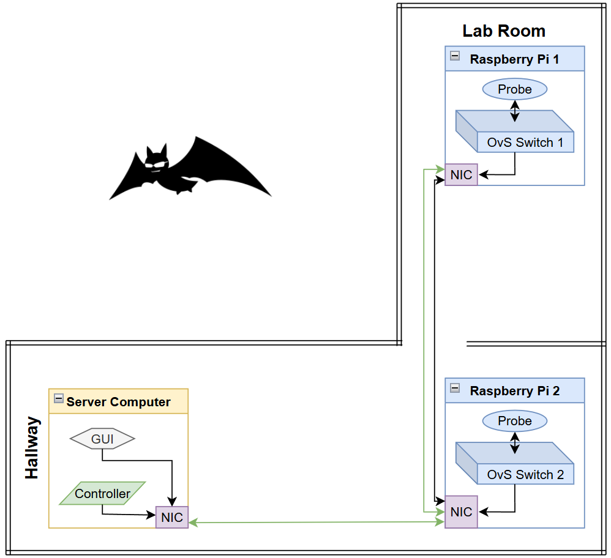

# Software Defined Network Functionalities on Wireless Mesh Network

This project aims to implement software defined networking (SDN) capabilities onto a wireless mesh network (WMN). It will take advantage of a WMN underlay network as the main routing back bone while there will be an SDN overlay networking running on top that will provide the typical suite of SDN functionalities. 

The project is built as a individual WMN enabled hosts communicating with each other via the BATMAN protocol. Each host will then become OpenFlow enabled, with one host serving as a SDN controller while the others will act as SDN enabled hosts with a virtual swtich.  Included is a pub/sub styled GUI that can request the following information from each SDN host: Batman IV link quality, and drone location (in progress).

This repository is tied to a thesis paper that will have a much more thorough explanation of how every piece works together, what software and hardware were chosen and the justifications why. 

## Software Choice
This project uses Better Approach to Mobile Ad-hoc Networking (BATMAN) for the WMN, OpenFlow for SDN, and OpenVSwitch as the virtual SDN enabled switch. 

Because this project is meant to be implemented onto a drone network in the future, hardware switches are not an option. Virtualization of OpenFlow will be mandatory for this project.
## Hardware Choice
We used Raspberry Pi 4's running Raspberry Pi OS (64-bit) on all Pi devices. These will act as our SDN enabled host devices and will be running OpenvSwitch. 

We used the Dell XPS 15 9560. This laptop will be hosting the SDN controller, the SDN GUI, and the pub/sub GUI all at the same time. It has a 4 core CPU that is more than capable of hosting all 3 software. It is running Ubuntu 20.04.6 LTS.

These devices were chosen because they can the following: Python 3.8, a version crucial for the Ryu SDN controller; OpenFlow 1.3 and OpenvSwitch; Batman IV and Batman V routing algorithms.

## Recreating This Project
#### SUDO ACCESS 
To recreate this project, we recommend starting from these folders:

1. BATMAN
2. OpenFlow
3. Pub/Sub GUI

All folders will contain the instructions and details about what commands are used. Scripts to setup BATMAN and OpenFlow are included in their respective folders. Instructions to run the Pub/Sub GUI are included in its respective folder. We recommend starting in the BATMAN folder first, then OpenFlow, then setting up the GUI. 

As for the physical test bench setup, provided below is the layout.

To encourage multi-hop communication, we forced our controller into a dead zone where Raspberry Pi 1 cannot directly communicate with it. Raspberry Pi 1 must talk through Raspberry Pi 2 in order to communicate with the controller. Note, because BATMAN is doing routing, you must force the BATMAN nodes to communicate via multi-hop first.

